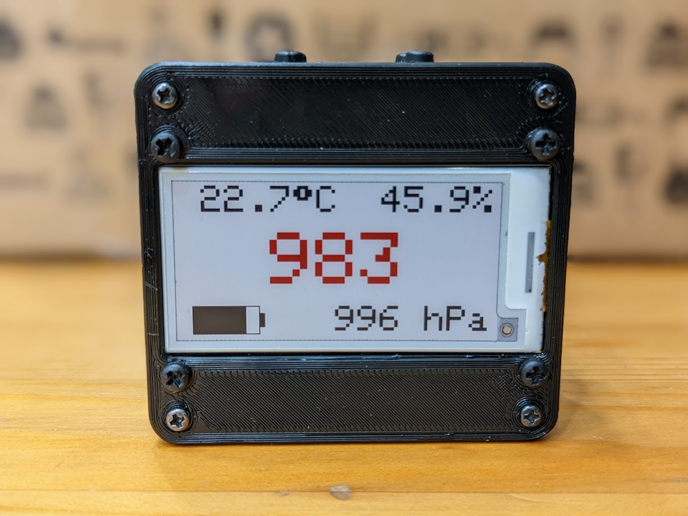
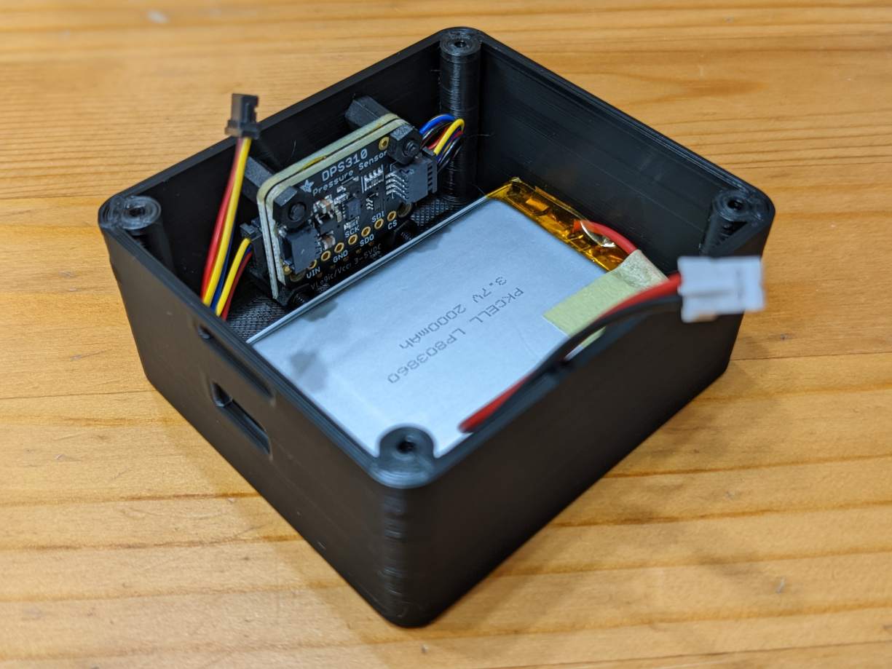
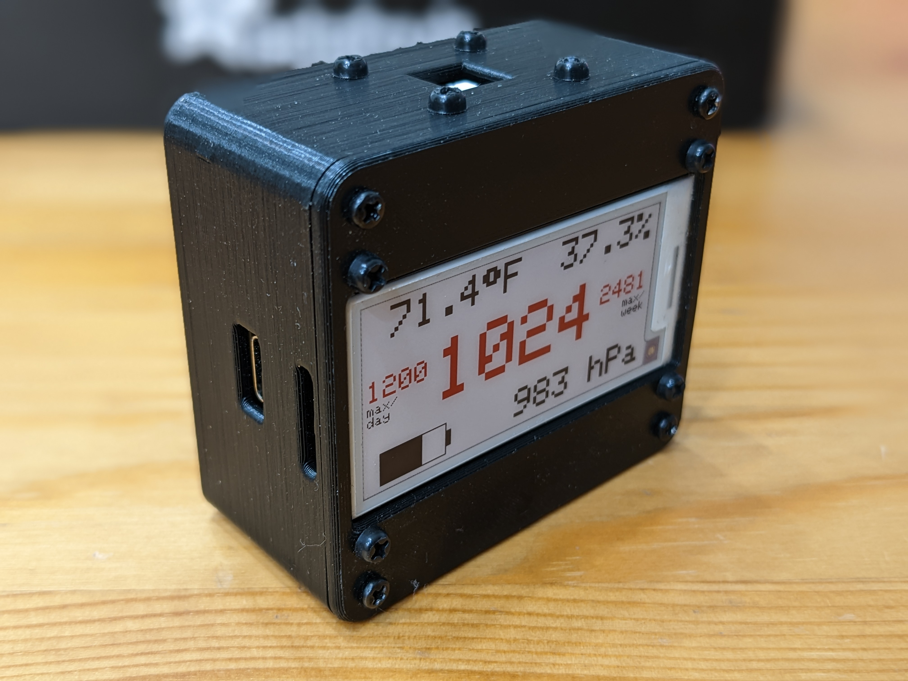

# Adanet CO₂ Monitor

The ambient CO₂ level is important for at least three reasons:

1. Excessive CO₂ can lead to a [decline in cognitive ability and sleep quality](https://slatestarcodex.com/2018/08/23/carbon-dioxide-an-open-door-policy/)
2. CO₂ levels can be used to as a [proxy for good ventilation and COVID risk](https://www.cdc.gov/coronavirus/2019-ncov/community/ventilation.html#faq-53432-answer0)
3. You can [monitor climate change](https://www.climate.gov/news-features/understanding-climate/climate-change-atmospheric-carbon-dioxide) in real time!

The [Wirecutter-recommended](https://www.nytimes.com/wirecutter/reviews/best-home-air-quality-monitor/) CO₂ monitor for personal use is the [Aranet4](https://aranet.com/products/aranet4/), and if you're just looking for something reliable and can afford it ($250 as of writing), stop reading and go buy one of those (or for a _slightly_ cheaper option, one of [these](https://www.co2.click/)).

---

Still here? Congratulations on not taking the coward's way out. Now let's build a thing!

The Adanet CO₂ Monitor has the following features:

- CO₂ (ppm), temperature (°C), relative humidity (%), battery life (%), and pressure (hPa) sensing
- "Tri-color" E Ink screen (black, red, and white I guess?)
- Long-ish battery life (~several weeks on a single charge)
- USB-C charging (and programming!) interface
- Built-in Wi-Fi and Bluetooth for feature expansion (currently disabled in software) 

## BOM

Most of the COTS parts are from [Adafruit](https://www.adafruit.com/) (hence the "Ada" prefix), but can be sourced through any of their distributors (and/or substituted for equivalents, but YMMV). Here's a snapshot of the [current BOM and pricing from Octopart](https://octopart.com/bom-tool/mcNhRVmk):

| Qty |  MPN |                                        Part Description                                        | Unit Price | Batch Total |
|:---:|:----:|:----------------------------------------------------------------------------------------------:|:----------:|:-----------:|
|   1 | 5477 | Adafruit Esp32-S3 Feather With 4Mb Flash 2Mb Psram - Stemma Qt / Qwiic                         |       17.5 |        17.5 |
|   1 | 4814 | Adafruit 2.13 Hd Tri-Color Eink / Epaper Display Featherwing - 250X122 Rw   Panel With Ssd1680 |      24.95 |       24.95 |
|   1 | 5190 | Adafruit SCD-41 - True CO2 Temperature and Humidity Sensor                                    |       59.5 |        59.5 |
|   1 | 4494 | Adafruit DPS310 Precision Barometric Pressure/Altitude Sensor - STEMMA   QT/Qwiic              |       6.95 |        6.95 |
|   1 | 2011 | Lithium Ion Battery - 3.7V 2000mAh                                                             |       12.5 |        12.5 |
|   2 | 4399 | STEMMA QT / Qwiic JST SH 4-Pin Cable - 50mm Long                                               |       0.95 |         1.9 |
|     |      |                                                                                                |            |      123.30 |

In addition, you'll need several fasteners. Most come in the [Adafruit 3299](https://www.adafruit.com/product/3299) kit, but this is overkill (only 20 out of the 380 pieces are used), so you may have better luck at a hardware store. Either way, you'll need:

| Qty |        Part Description       | Material |
|:---:|:-----------------------------:|----------|
|   8 | M2.5 Hex Nut                  | Nylon    |
|   8 | M2.5 x 6mm Screw              | Nylon    |
|   4 | M2.5 x 6mm M-F Hex Standoff   | Nylon    |
|   4 | M2.3 x 5mm Self-Tapping Screw | Steel    |

I also bought the self-tapping screws in [a kit](https://smile.amazon.com/dp/B081DVZMHH), but there are almost certainly cheaper options.

Finally, you'll need to 3D print the "top" and "bottom" pieces. If you don't have a 3D printer, either ask someone who does (these are relatively easy parts), visit to a local maker space (maybe even [your library?](https://www.chipublib.org/maker-lab/)), or use a service like [(3D)Hubs](https://www.hubs.com/). (Note: I recommend printing the "top" upside down, both to get a smooth finish on the outside and to avoid unnecessary overhangs.)

If you want to modify the design or are just curious, the parametric model is available at [OnShape](https://cad.onshape.com/documents/5da5dcb1f603a01f8bec88c9/w/ca967a8a956dc66b8484bce3/e/ef1ece94c6975fbb49878b31?renderMode=0&uiState=6315320c2f77803a879eb7f9).

## Assembly

First assemble the top and bottom of the case separately:

### Top

1. Attach the Feather board to the FeatherWing display as shown [here](https://learn.adafruit.com/adafruit-2-13-eink-display-breakouts-and-featherwings/wiring) (under "FeatherWing Connection")
2. Screw the assembly into the underside using 4 M2.5 x 6mm screws and 4 M2.5 hex nuts. Make sure that the flexible PCB on the FeatherWing (on the right in the image below) fits into the rectangular slot!

### Bottom

1. Use 4 M2.5 x 6mm screws to attach the 4 M2.5 x 6mm M-F hex standoffs to the inside of the case (using the holes that border the the sensor slot)
2. Attach the 4-pin STEMMA QT cables to either side of the SCD41 board
3. Press the SCD41 board onto the four exposed standoffs, with the sensor facing "out" of the case, and use 2 M2.5 hex nuts to secure to the bottom two standoffs
4. Connect the DPS310 to the 4-pin STEMMA QT cable on the "right" (when facing the non-sensor side) of the SCD41 board
5. Use 2 M2.5 hex nuts to attach the DPS310 to the top two standoffs, back-to-back with the SCD41 so that the sensor is facing "in" (note: first apply Kapton/electrical tape to the back of the DPS310 to avoid shorting to the SCD41)
6. Carefully insert the battery, which should fit snugly lengthwise, and adjacent to the bottom standoffs holding the SCD41 (note: you can use double-sided tape securely affix the battery to the case)

Once both the top and bottom are assembled, connect the remaining 4-pin STEMMA QT and battery to the Feather board (middle and side connectors respectively). Close the lid to ensure a good fit, but don't install the 4 M2.3 x 5mm self-tapping screws until loading the firmware (as the BOOT/DFU and Reset buttons are not externally accessible)!

Once complete, your final assembly should look like this:

## Firmware

The Arduino firmware (adanet-co2-monitor.ino) has been tested using the following software (and corresponding versions):

- Arduino IDE (v1.8.19 or v2.0.0)
- Adafruit DPS310 (v1.1.1)
- Adafruit EPD (v4.5.0)
- Adafruit LC709203F (v1.3.1)
- ESP32 Arduino (v2.0.5)
- Sensirion I2C SCD4x (v0.3.1)

To prepare your development environment:

1. Install [Arduino IDE](https://www.arduino.cc/en/software/) (and optionally the [VS Code extension](https://github.com/microsoft/vscode-arduino))
2. Follow [these instructions](https://docs.espressif.com/projects/arduino-esp32/en/latest/installing.html) to install the ESP32 Arduino library
3. Using the Library Manager (Tools/Manage Libraries...), install the remaining libraries listed above
4. Under Tools/Board (or Arduino: Board Config), select the "Adafruit Feather ESP32-S3 2MB PSRAM" option
5. In the same menu, change "USB Mode" to "Hardware CDC and JTAG" (see [here](https://github.com/espressif/arduino-esp32/issues/6762)) and "Upload Mode" to "UART0/Hardware CDC"
6. Plug in your Feather using the USB-C connector, and set the Port to match the one assigned by your OS (e.g. `COM5` on Windows, `/dev/ttyACM0` on Linux)

To load the firmware on the device:

1. Clone this repository somewhere sensible (Arduino projects are typically located in the `$HOME/Documents/Arduino` folder)
2. While holding the BOOT/DFU button, press and release the Reset button, putting the Feather into [ROM bootloader mode](https://learn.adafruit.com/adafruit-esp32-s2-feather/factory-reset)
3. If loading firmware for the first time, initialize and calibrate the sensor using the [adanet-init](adanet-init) program
4. In Arduino (or VS Code using the [Arduino extension](https://github.com/microsoft/vscode-arduino)), open the arduino-co2-monitor.ino file and click Upload (or run the Arduino: Upload task in VS Code)
5. Once finished, you may have to manually press the Reset button again to start the firmware

And that's it! The firmware does the following once every 180 seconds (the [fastest update rate](https://learn.adafruit.com/adafruit-2-13-eink-display-breakouts-and-featherwings/usage-expectations) supported by the E Ink screen):

1. Enable the SCD41 and DPS310 sensors, start measurements
2. Light sleep for 5 seconds while the initial CO₂ and pressure measurements are taking place
3. Update SCD41 with ambient pressure (the [nominal reason](http://www.co2meters.com/Documentation/AppNotes/AN149-Senseair-Pressure-Dependence.pdf) for the DPS301 sensor!)
4. Discard initial measurements (as per [SCD41 Low Power Operation](https://sensirion.com/media/documents/077BC86F/62BF01B9/CD_AN_SCD4x_Low_Power_Operation_D1.pdf)) and light sleep for another 5 seconds
5. Read battery charge state from the LC709203F sensor
6. Save new measurements and disable I2C power (turns off all sensors)
7. Enable the E Ink screen and update the display using the saved measurements
8. Deep sleep for ~170 seconds and repeat
